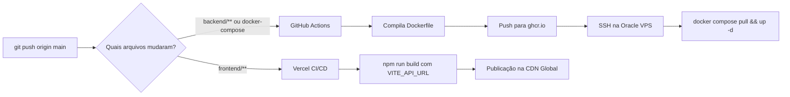

# Flow Chamados - Arquitetura Full-Stack, Trello & CI/CD Produção

Sistema de chamados com fluxo de atendimento sincronizado estritamente via Webhooks do Trello, conteinerizado em Docker para a VPS Oracle e com Frontend no Vercel.

---

## 1. Arquitetura de Produção

```mermaid
flowchart TD
    subgraph Cliente e Equipe
        User[Navegador / Cliente]
        Agent[Atendente no Trello]
    end

    subgraph Nuvem Vercel
        VercelFront[Frontend SPA React + Vite\nhttps://flow.seudominio.com]
    end

    subgraph Atlassian Cloud
        TrelloBoard[Quadro Trello com 4 Listas\nCriado | Em andamento | Aguardando | Finalizado]
    end

    subgraph Oracle Cloud VPS
        Nginx[Nginx Reverse Proxy + SSL Let's Encrypt\nhttps://api.seudominio.com]
        subgraph Docker Compose
            Backend[Container Spring Boot 3\n:8080]
            Postgres[(Container PostgreSQL 16\nVolume persistente :5432)]
        end
    end

    User -->|Acessa interface| VercelFront
    VercelFront -->|Chamadas REST| Nginx
    Nginx -->|Proxy reverso :8080| Backend
    Backend -->|Persistência JPA| Postgres
    Backend -->|Criação de Cards| TrelloBoard
    Agent -->|Arrasta card no Kanban| TrelloBoard
    TrelloBoard -->|Webhook POST /api/webhooks/trello| Nginx
```

---

## 2. 🚀 Fluxo de CI/CD (GitHub Actions + Vercel)

O repositório está configurado com **filtros de caminhos (Path Filtering)** para deploys independentes:



---

## 3. ⚙️ Como Subir a Produção

### Etapa 1: Apontamentos de Domínio (DNS)

No painel do seu domínio (Cloudflare, Registro.br, etc.):

| Tipo | Nome | Destino | Finalidade |
|---|---|---|---|
| `A` | `api` | `IP_PUBLICO_DA_ORACLE_VPS` | Backend Spring Boot & Webhooks |
| `CNAME` | `chamados` | `cname.vercel-dns.com` | Frontend no Vercel (opcional se usar domínio próprio) |

---

### Etapa 2: Preparar a VPS da Oracle

1. Conecte na sua VPS via SSH:
   ```bash
   ssh ubuntu@SEU_IP_ORACLE
   ```
2. Execute o script de preparação:
   ```bash
   curl -fsSL https://raw.githubusercontent.com/SEU_USUARIO/flow-chamados/main/deploy/setup-vps.sh | bash
   ```
   *(Ou clone o repositório em `/opt/flow-chamados`)*.

3. Configure o Nginx e o SSL com Let's Encrypt:
   ```bash
   sudo cp /opt/flow-chamados/deploy/nginx/api.conf /etc/nginx/sites-available/api.seudominio.com
   sudo ln -s /etc/nginx/sites-available/api.seudominio.com /etc/nginx/sites-enabled/
   sudo certbot --nginx -d api.seudominio.com
   ```

4. Configure o arquivo `/opt/flow-chamados/.env` com as credenciais do PostgreSQL e do Trello:
   ```env
   TRELLO_WEBHOOK_URL=https://api.seudominio.com/api/webhooks/trello
   CORS_ALLOWED_ORIGINS=https://flow-chamados.vercel.app,https://chamados.seudominio.com
   ```

5. Suba os containers pela primeira vez:
   ```bash
   cd /opt/flow-chamados
   docker compose up -d
   ```

---

### Etapa 3: Configurar os Secrets no GitHub (Para Deploy Automático)

No seu repositório no GitHub, vá em **Settings** ➡️ **Secrets and variables** ➡️ **Actions** e adicione:

* `VPS_HOST`: O IP público da sua Oracle VPS.
* `VPS_USER`: O usuário SSH da VPS (ex: `ubuntu` ou `opc`).
* `VPS_SSH_KEY`: O conteúdo da sua chave privada SSH (o arquivo `.pem` ou `id_rsa`).
* `VPS_PORT`: Porta SSH (padrão: `22`).

---

### Etapa 4: Configurar o Frontend no Vercel

1. Acesse [vercel.com](https://vercel.com) e importe o repositório `flow-chamados`.
2. Configure:
   - **Root Directory:** `frontend`
   - **Framework Preset:** `Vite`
3. Em **Environment Variables**, adicione:
   - **Key:** `VITE_API_URL`
   - **Value:** `https://api.seudominio.com`
4. Clique em **Deploy**.

---

## 4. 🗄️ Estrutura de Arquivos

```text
flow-chamados/
├── .github/workflows/
│   └── deploy-backend.yml       # Pipeline CI/CD automático para a VPS
├── backend/
│   ├── Dockerfile               # Build multi-stage leve com Eclipse Temurin 17
│   ├── pom.xml
│   └── src/
├── frontend/
│   ├── vercel.json              # Regras de rewrite SPA do Vercel
│   ├── src/services/api.ts      # Chaveia entre proxy local ou VITE_API_URL
│   └── src/App.tsx
├── deploy/
│   ├── nginx/api.conf           # Configuração de proxy reverso e SSL Let's Encrypt
│   └── setup-vps.sh             # Script de setup rápido da VPS
├── docker-compose.yml           # Orquestração do Backend + PostgreSQL com volume persistente
├── .env.example
└── README.md
```
